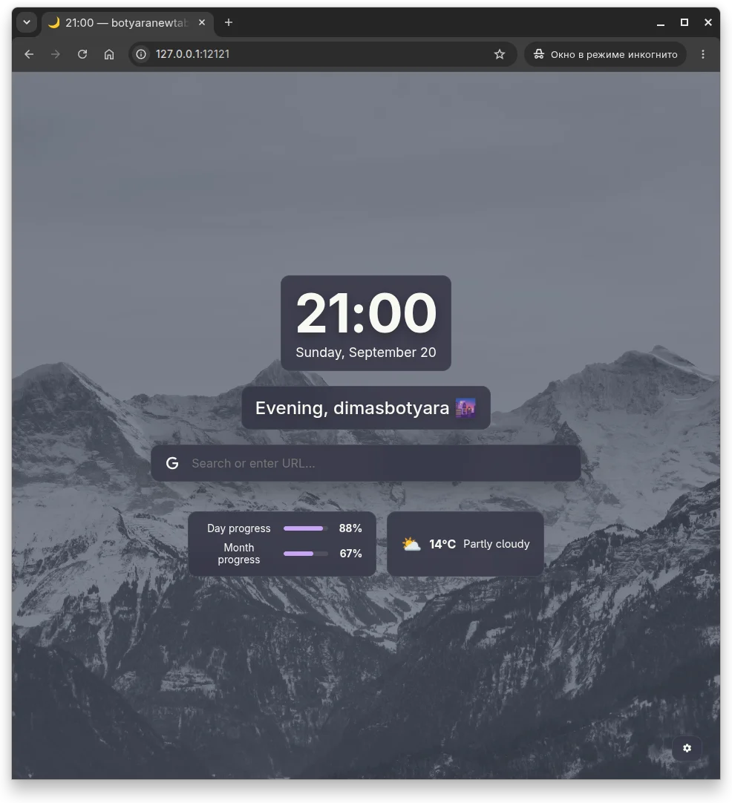
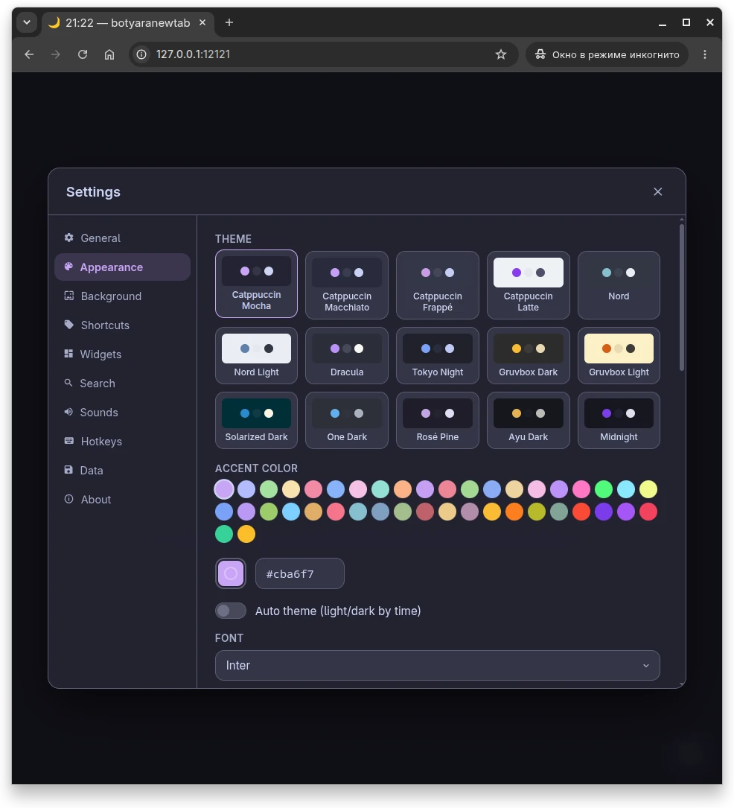
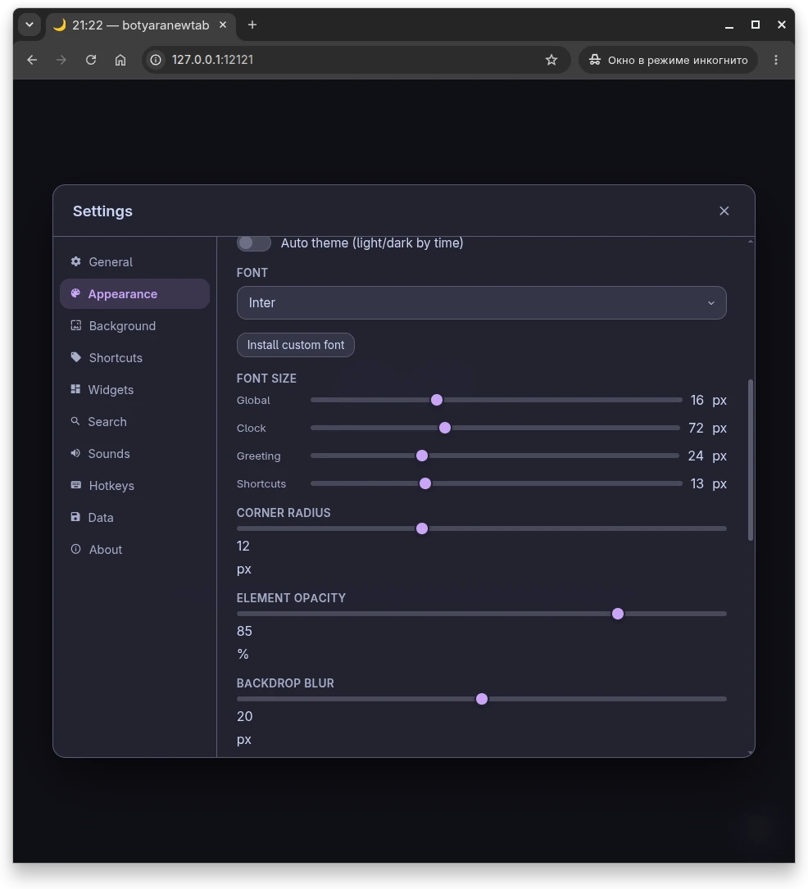
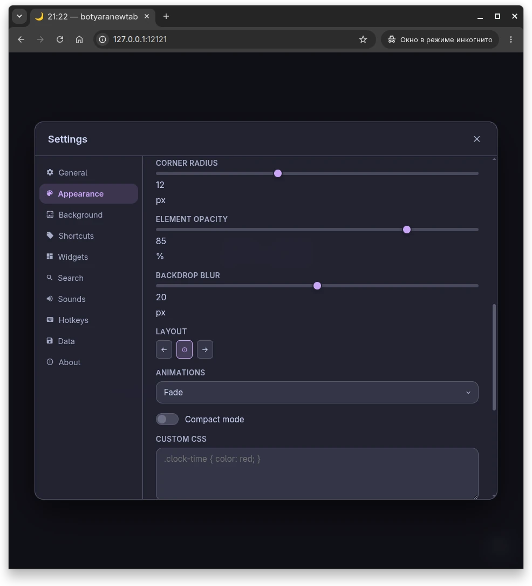
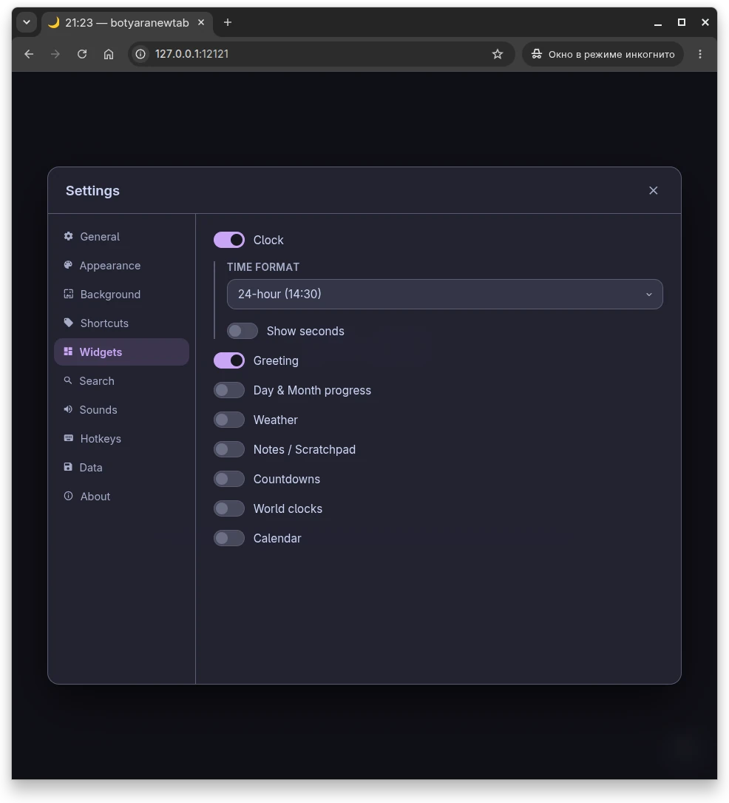
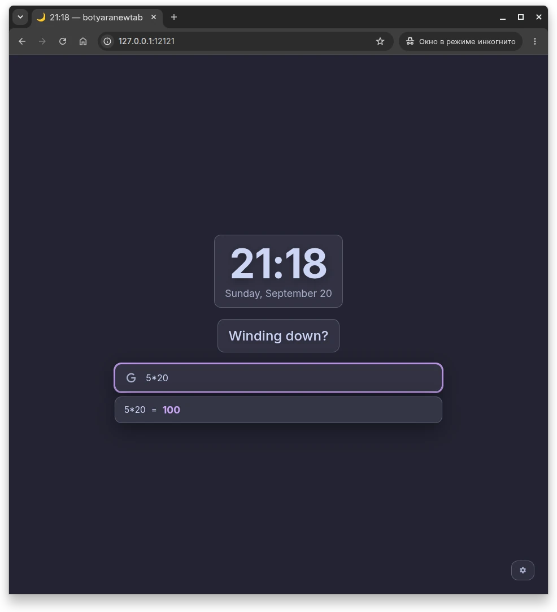
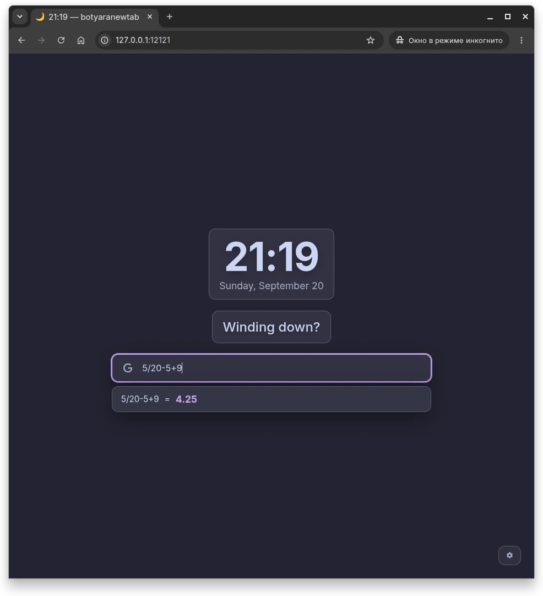
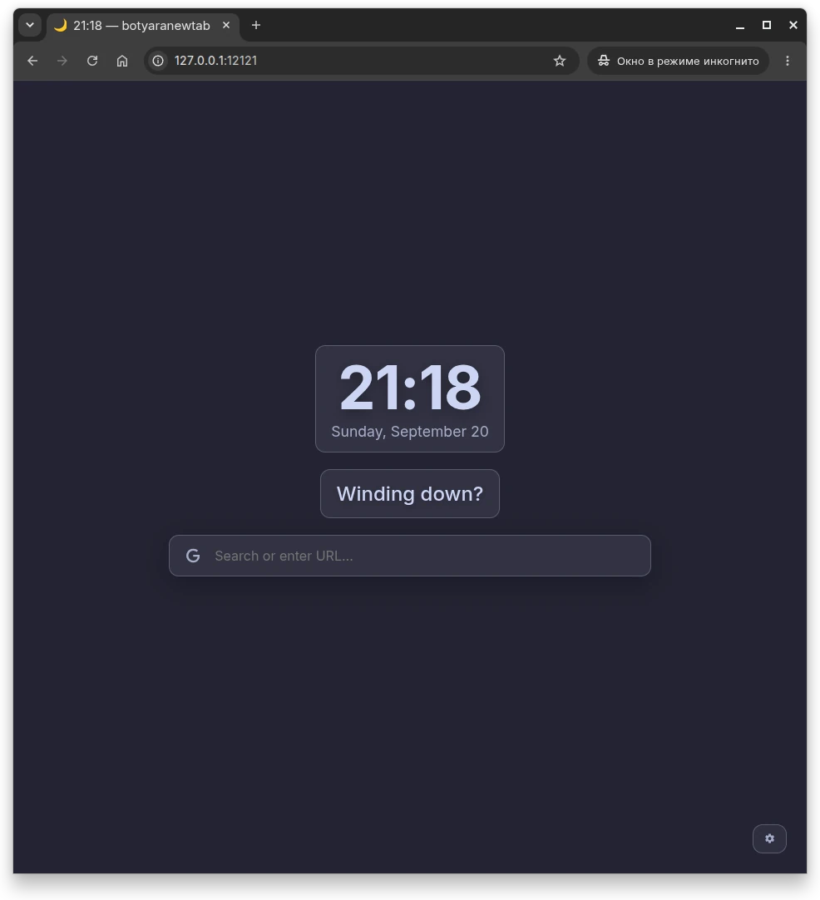

<div align="center">

# 🌙 botyaranewtab

**Your new tab. Your rules.**

A beautiful, fully customizable, local-first new tab page for your browser.
No cloud. No telemetry. No accounts. Just you and your data.

🇬🇧 **English** · [🇷🇺 Русский](README.ru.md)


</div>

---

<p align="center">
  
</p>

---

## 📖 Table of Contents

- [✨ What is this?](#-what-is-this)
- [🎯 Features](#-features)
- [📸 Screenshots](#-screenshots)
- [🚀 Quick Start](#-quick-start)
- [🌐 Setup as New Tab](#-setup-as-new-tab)
- [⚙️ Configuration](#️-configuration)
- [🔄 Autostart](#-autostart)
- [🎨 Customization](#-customization)
- [⌨️ Hotkeys](#️-hotkeys)
- [🔌 API Reference](#-api-reference)
- [📁 Project Structure](#-project-structure)
- [🛠️ Tech Stack](#️-tech-stack)
- [🤝 Contributing](#-contributing)
- [🥚 Easter Egg](#-easter-egg)
- [📜 License](#-license)
- [👤 Author](#-author)

---

## ✨ What is this?

**botyaranewtab** is a self-hosted, fully customizable browser new tab page. It runs on your machine, stores everything in a local SQLite database, and never sends a single byte to the cloud.

Unlike other new tab extensions that lock you into their design, their servers, and their analytics — **botyaranewtab gives you the source code and the keys**. Change the CSS, add widgets, upload your own fonts, replace the background daily. It's your page. Your rules.

**Built for people who:**
- 🧠 Want their new tab to actually be *useful*, not an ad-heavy dashboard
- 🔒 Care about privacy and don't want their browsing data in someone else's cloud
- 🎨 Love tinkering and want full control over every pixel
- 💻 Prefer vanilla JS over a 200MB node_modules folder

---

## 🎯 Features

### 🎨 Appearance
- **15+ built-in themes** — Catppuccin (Mocha, Macchiato, Frappé, Latte), Nord, Dracula, Tokyo Night, Gruvbox, Solarized, One Dark, Rosé Pine, Ayu, Midnight and more
- **Accent color palette** — pick from your theme's palette or use any custom hex
- **Custom fonts** — install your own `.woff2`, `.woff`, `.ttf`, `.otf` right from the settings panel
- **Adjustable font sizes** — global, clock, greeting, shortcuts separately
- **Corner radius, opacity, backdrop blur** — every slider you could want
- **Auto theme** — light during the day, dark at night
- **Custom CSS** — inject anything you want

### 🖼️ Backgrounds
- **4 sources** — theme color, image, gradient, solid color
- **8 scale modes** — cover, contain, stretch, tile, center, fit-width, fit-height, fill-blur
- **3×3 position grid** — pixel-perfect placement
- **Effects** — blur, dim, brightness, saturation, sepia, grayscale, vignette
- **Motion** — Ken Burns (slow zoom), parallax (mouse follow), auto-rotation with configurable interval
- **Adaptive color** — extracts the dominant color from your wallpaper and applies it as accent

### 🔍 Smart Search
- **Bang commands** — `!g` Google, `!yt` YouTube, `!w` Wikipedia, `!gh` GitHub, `!r` Reddit, `!maps`, `!img`, `!translate` and more
- **Inline calculator** — type `2+2` or `sqrt(16)` right in the search bar
- **Unit converter** — `10 km to miles`, `100 f to c`, `5 gb to mb`
- **Color preview** — type `#cba6f7` and see a swatch instantly
- **Autocomplete** — suggests from your own search history
- **Smart URL detection** — type `github.com` and it just works
- **Search history** — saved locally, clearable in one click

### 🔗 Shortcuts
- **Folders** — group related links, get a mini-preview of what's inside
- **Custom icons** — upload your own, or auto-fetch favicons
- **Custom colors** — tile background for each shortcut
- **Click counter** — see which shortcuts you actually use
- **Bookmark import** — HTML/JSON from your browser
- **Export to JSON** — because your shortcuts are yours

### 🌤️ Widgets
- **Clock** — 24h or 12h (AM/PM), optional seconds
- **Greeting** — 50+ variations per time-of-day, per language, with your name
- **Weather** — powered by [Open-Meteo](https://open-meteo.com/) (no API key needed!)
- **World clocks** — track time in multiple timezones
- **Countdowns** — days until your birthday, vacation, D&D session
- **Notes / Scratchpad** — auto-saves as you type
- **Calendar** — clean monthly view
- **Day & month progress** — see how much of today is gone

### ⚡ Power features
- **Focus mode** — hides everything except clock and search
- **Zen mode** — only wallpaper and a small clock
- **Real-time sync** — change settings in one tab, they update in all others (SSE)
- **PWA support** — installable, works offline
- **Hotkeys** — `/` for search, `Ctrl+,` for settings, `Ctrl+K` for command palette, and more
- **i18n** — English and Russian out of the box
- **Backups** — download/restore the whole database in one click
- **Settings export/import** — JSON for portability

---

## 📸 Screenshots

### 🏠 Main view

<p align="center">
  
</p>

### 🎛️ Settings — deep customization

<p align="center">
  
  
  
</p>

### 🧩 Widgets

<p align="center">
  
</p>

### 🔍 Inline calculator & smart search

<p align="center">
  
  
</p>

### 🎨 Default look (out of the box)

<p align="center">
  
</p>

---

## 🚀 Quick Start

### Requirements

- **Python 3.10+** (uses `X | None` type hints)
- A modern browser (Chrome, Firefox, Edge, Brave, Vivaldi, or any Chromium-based)
- ~50 MB disk space (plus whatever wallpapers you upload)

### Installation

```bash
# 1. Clone the repository
git clone https://github.com/dimasbotyara/botyaranewtab.git
cd botyaranewtab

# 2. Create a virtual environment
python -m venv .venv

# 3. Activate it
source .venv/bin/activate         # Linux / macOS
# .venv\Scripts\activate          # Windows

# 4. Install dependencies
pip install -r requirements.txt

# 5. Run it
python run.py
```

You'll see a nice banner in the terminal:

```
╭──────────────────────────────────────────╮
│  botyaranewtab — your new tab, your rules │
╰──────────────────────────────────────────╯

  Initializing database…
  Database ready!

  Server starting at: http://127.0.0.1:12121

  Set this URL as your new tab page:
  Extension → Custom New Tab URL → http://127.0.0.1:12121
```

Open **http://127.0.0.1:12121** in your browser. Done. 🎉

---

## 🌐 Setup as New Tab

botyaranewtab runs as a local web server, so you need a browser extension to point your new tab at it.

### Chrome / Edge / Brave / Vivaldi

1. Install the [Custom New Tab URL](https://chromewebstore.google.com/detail/mmjbdbjnoablegbkcklggeknkfcjkjia) extension
2. Open its settings
3. Set the URL to: `http://127.0.0.1:12121`
4. Open a new tab — done

### Firefox

1. Install [New Tab Override](https://addons.mozilla.org/en-US/firefox/addon/new-tab-override/)
2. In its settings, choose "Custom URL"
3. Set it to: `http://127.0.0.1:12121`

### Safari

Safari doesn't allow custom new tab URLs without a native extension. You can still open `http://127.0.0.1:12121` manually or bookmark it.

---

## ⚙️ Configuration

All configuration is done via the in-app settings panel (`Ctrl+,` or the gear icon). Nothing to edit manually.

### Where things live

| Path | What |
|---|---|
| `botyaranewtab.db` | SQLite database — all your settings, shortcuts, notes |
| `static/backgrounds/` | Uploaded wallpapers |
| `static/icons/` | Cached favicons + custom shortcut icons |
| `static/fonts/Custom/` | Your installed fonts |
| `backups/` | Database backups |
| `config.py` | Port, host, paths |

### Changing the port

If `12121` is taken on your machine, edit `config.py`:

```python
HOST = "127.0.0.1"
PORT = 12121   # ← change this
```

Then update the URL in your browser extension and in the About section of the app.

### Environment variables (optional)

You can override the host and port without touching `config.py`:

```bash
BOTYARA_PORT=5555 python run.py
```

---

## 🔄 Autostart

Want botyaranewtab to always be running in the background? Here's how to set it up.

### Linux (systemd)

Create `~/.config/systemd/user/botyaranewtab.service`:

```ini
[Unit]
Description=botyaranewtab
After=network.target

[Service]
Type=simple
WorkingDirectory=/path/to/botyaranewtab
ExecStart=/path/to/botyaranewtab/.venv/bin/python /path/to/botyaranewtab/run.py
Restart=always
RestartSec=3

[Install]
WantedBy=default.target
```

Enable it:

```bash
systemctl --user daemon-reload
systemctl --user enable --now botyaranewtab
```

Check status:

```bash
systemctl --user status botyaranewtab
```

### macOS (launchd)

Create `~/Library/LaunchAgents/com.botyaranewtab.plist`:

```xml
<?xml version="1.0" encoding="UTF-8"?>
<!DOCTYPE plist PUBLIC "-//Apple//DTD PLIST 1.0//EN"
  "http://www.apple.com/DTDs/PropertyList-1.0.dtd">
<plist version="1.0">
<dict>
    <key>Label</key>
    <string>com.botyaranewtab</string>
    <key>ProgramArguments</key>
    <array>
        <string>/path/to/botyaranewtab/.venv/bin/python</string>
        <string>/path/to/botyaranewtab/run.py</string>
    </array>
    <key>RunAtLoad</key>
    <true/>
    <key>KeepAlive</key>
    <true/>
</dict>
</plist>
```

Load it:

```bash
launchctl load ~/Library/LaunchAgents/com.botyaranewtab.plist
```

### Windows

1. Create a shortcut to `run.py` using your venv's python:
   ```
   Target: C:\path\to\botyaranewtab\.venv\Scripts\pythonw.exe C:\path\to\botyaranewtab\run.py
   ```

2. Press `Win+R`, type `shell:startup`, hit Enter
3. Move the shortcut into the folder that opens

Done — botyaranewtab will start with Windows.

---

## 🎨 Customization

### Themes

Pick from the built-in collection, or **build your own** by editing `static/js/themes.js`:

```javascript
const Themes = {
    list: {
        'my-theme': {
            name: 'My Theme',
            type: 'dark',
            colors: {
                '--bg-base': '#0a0a0a',
                '--bg-surface': '#1a1a1a',
                '--text-primary': '#ffffff',
                '--accent': '#ff00ff',
                // ...
            }
        }
    }
};
```

Reload the page and your theme shows up in the Appearance panel.

### Custom CSS

Appearance → **Custom CSS** field. Anything you put there gets injected as a `<style>` tag. Examples:

```css
/* Make the clock neon */
.clock-time {
    color: #ff00ff;
    text-shadow: 0 0 20px #ff00ff;
}

/* Hide the date */
.clock-date {
    display: none;
}

/* Bigger search bar */
.search-wrapper {
    max-width: 900px;
    padding: 12px 20px;
}
```

### Bang commands

Edit `search_engine.py` → `BANG_COMMANDS` dict:

```python
BANG_COMMANDS = {
    "!g": "https://www.google.com/search?q={}",
    "!yt": "https://www.youtube.com/results?search_query={}",
    # Add your own:
    "!so": "https://stackoverflow.com/search?q={}",
    "!np": "https://www.npmjs.com/search?q={}",
}
```

Restart the server, and they work.

### Fonts

1. Get a `.woff2` file from [fontsource](https://fontsource.org/) or anywhere
2. Appearance → Font → **Install font** → pick the file
3. It appears in the font dropdown immediately

---

## ⌨️ Hotkeys

| Shortcut | Action |
|---|---|
| `/` | Focus search bar |
| `Esc` | Clear search / close modal |
| `Ctrl` + `,` | Open settings |
| `Ctrl` + `K` | Command palette (focus search with `!`) |
| `Ctrl` + `1..9` | Open the Nth shortcut |
| `Ctrl` + `Shift` + `F` | Toggle Focus Mode |
| `Ctrl` + `Shift` + `Z` | Toggle Zen Mode |

Plus: **right-click anywhere on the background** to open settings, if enabled.

---

## 🔌 API Reference

All endpoints are under `/api/`. The frontend uses them; you can too.

### Settings

| Method | Endpoint | Description |
|---|---|---|
| `GET` | `/api/settings` | Get all settings |
| `POST` | `/api/settings` | Update one or more settings |
| `POST` | `/api/settings/reset` | Reset to defaults |
| `GET` | `/api/settings/export` | Download settings as JSON |
| `POST` | `/api/settings/import` | Upload settings JSON |

### Shortcuts

| Method | Endpoint | Description |
|---|---|---|
| `GET` | `/api/shortcuts` | List all |
| `POST` | `/api/shortcuts` | Add new |
| `PUT` | `/api/shortcuts/:id` | Update |
| `DELETE` | `/api/shortcuts/:id` | Delete |
| `POST` | `/api/shortcuts/:id/click` | Increment click counter |
| `GET` | `/api/shortcuts/export` | Download as JSON |
| `POST` | `/api/shortcuts/import` | Import from HTML/JSON |

### Widgets

| Method | Endpoint | Description |
|---|---|---|
| `GET` | `/api/weather` | Current weather (lat/lon) |
| `GET` | `/api/weather/geocode` | City → coordinates |
| `GET` | `/api/weather/reverse` | Coordinates → city |
| `GET` | `/api/countdowns` | List countdowns |
| `POST` | `/api/countdowns` | Add countdown |
| `DELETE` | `/api/countdowns/:id` | Delete countdown |
| `GET` | `/api/world-clocks` | List world clocks |
| `POST` | `/api/world-clocks` | Add world clock |
| `GET` | `/api/notes` | Get notes content |
| `POST` | `/api/notes` | Save notes |

### Data

| Method | Endpoint | Description |
|---|---|---|
| `GET` | `/api/backup/create` | Download database backup |
| `POST` | `/api/backup/restore` | Restore from backup |
| `GET` | `/api/events` | Server-Sent Events for live sync |

---

## 📁 Project Structure

```
botyaranewtab/
├── app.py                  # Flask app + all API routes
├── run.py                  # Entry point with banner
├── config.py               # Host, port, paths, version
├── database.py             # SQLite layer + migrations
├── utils.py                # Backups, font scanning
├── weather.py              # Open-Meteo integration
├── search_engine.py        # Bang commands, calculator, unit converter
├── greetings.py            # 50+ greetings per time / language
├── translations.py         # i18n strings (en, ru)
├── favicon_parser.py       # Favicon fetcher + cache
├── color_extractor.py      # Dominant color from images (Pillow)
│
├── templates/
│   └── index.html          # Single-page UI
│
├── static/
│   ├── css/
│   │   └── style.css       # All styles
│   ├── js/
│   │   ├── app.js          # Main controller, settings sync
│   │   ├── settings.js     # Settings modal logic
│   │   ├── search.js       # Search bar + previews
│   │   ├── shortcuts.js    # Shortcuts grid + folders
│   │   ├── widgets.js      # Clock, weather, countdowns
│   │   ├── background.js   # Wallpaper engine
│   │   ├── themes.js       # 15+ theme definitions
│   │   ├── i18n.js         # Frontend translations
│   │   ├── hotkeys.js      # Keyboard shortcuts
│   │   ├── toast.js        # Toast notifications
│   │   ├── confetti.js     # 🎉
│   │   └── sw.js           # Service worker (PWA)
│   ├── fonts/              # Inter, Geist, Manrope, Symbols
│   ├── backgrounds/        # User-uploaded wallpapers
│   ├── icons/              # Cached favicons
│   └── manifest.json       # PWA manifest
│
├── docs/screenshots/       # README images
├── backups/                # Database backups
├── requirements.txt
├── LICENSE
└── README.md
```

---

## 🛠️ Tech Stack

**Why these choices:**

- **Flask** — lightweight, no magic, easy to extend. Django is overkill, FastAPI is overkill, plain `http.server` is too bare.
- **SQLite** — perfect for local single-user apps. No setup, no server, no daemon.
- **Vanilla JS** — no build step, no bundler, no framework churn. Every file loads directly. This newtab loads in **under 50ms** on a cold cache.
- **waitress** — production-grade WSGI server, no Flask dev-server warnings
- **rich** — pretty terminal output
- **Pillow** — dominant color extraction from wallpapers
- **BeautifulSoup** — favicon scraping from web pages
- **Open-Meteo** — weather without an API key

---

## 🤝 Contributing

This is a personal project, but contributions are welcome. A few guidelines:

1. **Open an issue first** for big changes — I might be planning something
2. **Keep the no-build-step philosophy** — no npm, no bundler, no TypeScript
3. **Test in at least Chrome and Firefox**
4. **One feature per PR** — easier to review
5. **Match the existing code style** — modules, JSDoc-ish comments, `const` over `let`

Found a bug? [Open an issue](https://github.com/dimasbotyara/botyaranewtab/issues) with:
- What you did
- What you expected
- What actually happened
- Browser + OS + Python version
- Console output (F12 → Console) if applicable

---

## 🥚 Easter Egg

There's a tiny secret in the search bar. Try typing the developer's name and press Enter.

<details>
<summary>⚠️ Spoiler — click to reveal</summary>

Type **`dimasbotyara`** in the search bar and hit Enter. 🎉

</details>

---

## 📜 License

MIT — see [LICENSE](LICENSE) for details.

You can use this code for anything: personal, commercial, fork it, sell it, print it out and frame it. Just keep the copyright notice.

---

## 👤 Author

**dimasbotyara**

- GitHub: [@dimasbotyara](https://github.com/dimasbotyara)
- Project: [botyaranewtab](https://github.com/dimasbotyara/botyaranewtab)

---

<div align="center">

**If you find this useful, drop a ⭐ — it makes my day**

Made with 🌙 and too much coffee

</div>
